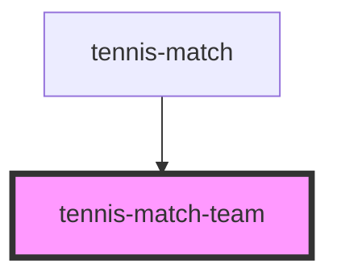

# tennis-match-team

<!-- Auto Generated Below -->

## Properties

| Property | Attribute | Description | Type          | Default     |
| -------- | --------- | ----------- | ------------- | ----------- |
| `team`   | --        |             | `TennisTeamI` | `undefined` |

## Dependencies

### Used by

 - [tennis-match](../tennis-match)

### Graph

----------------------------------------------

*Built with [StencilJS](https://stenciljs.com/)*
