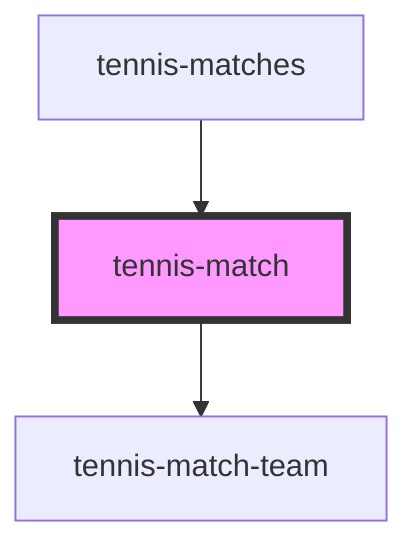

# tennis-match

<!-- Auto Generated Below -->

## Properties

| Property | Attribute | Description | Type           | Default     |
| -------- | --------- | ----------- | -------------- | ----------- |
| `match`  | --        |             | `TennisMatchI` | `undefined` |

## Dependencies

### Used by

 - [tennis-matches](../tennis-matches)

### Depends on

- [tennis-match-team](../tennis-match-team)

### Graph

----------------------------------------------

*Built with [StencilJS](https://stenciljs.com/)*
